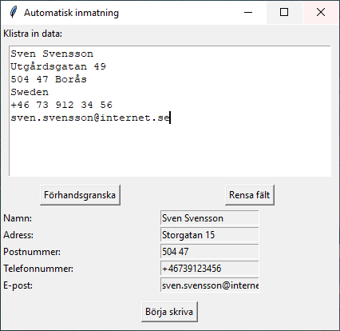
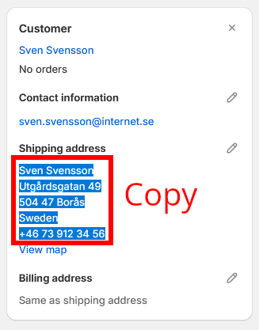
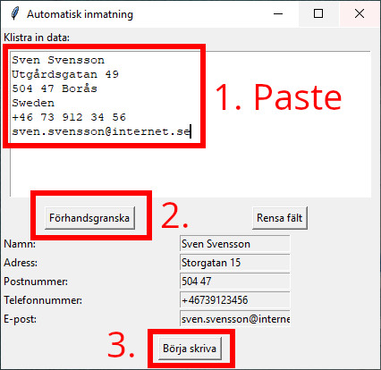
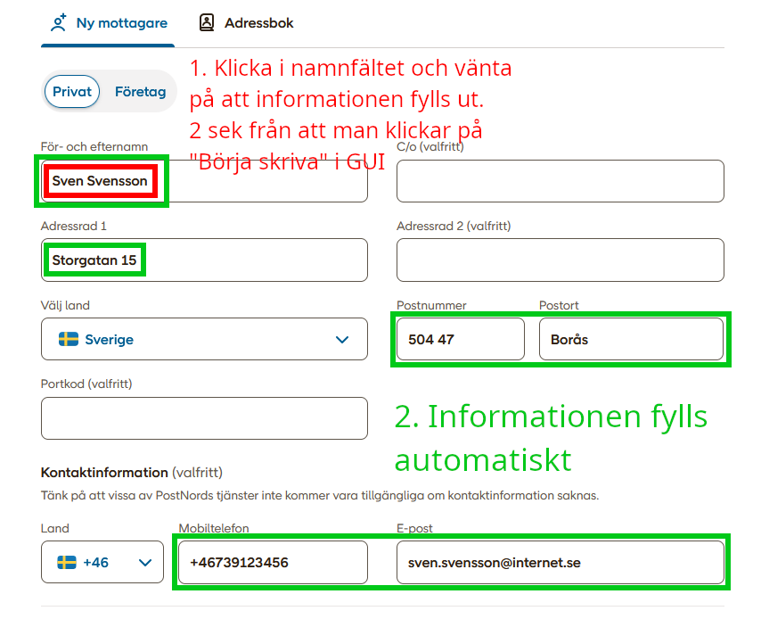

# Automatisk tangentbordsemulerad Inmatning till PostNord Portal

## Beskrivning
Detta script tillåter automatiserad inmatning av leveransinformation i PostNord Portal. Den manuella processen kan vara tidskrävande, särskilt för företag med många paket att hantera dagligen. Med detta script kan du enkelt kopiera leveransinformation från Shopify och med ett knapptryck mata in datan i PostNord Portal. Detta erbjuder en budgetvänlig lösning för företag som inte vill binda upp sig på en månadskostnad för ett API som automatiskt skapar etiketter.




## Funktioner
- **Kopiera och klistra in**: Möjlighet att kopiera leveransdata direkt från Shopify.
- **Automatisk fältinmatning**: Skriptet fyller automatiskt i informationen i PostNord Portal utan manuellt arbete.
- **Anpassningsbar**: Även om skriptet är optimerat för Shopify, kan det enkelt anpassas för att fungera med andra system.

## Hur man använder
1. Starta skriptet genom att köra det på din dator.
2. Kopiera leveransinformationen från Shopify eller annan plattform.
3. Klistra in informationen i textfältet i scriptets GUI.
4. Använd knappen "Förhandsgranska" för att se över den inmatade datan.
5. Klicka på "Börja skriva" för att börja automatisk inmatning i PostNord Portal.





## Systemkrav
- Python 3
- Tkinter för GUI
- Pynput för tangentbordskontroll

## Installation
Klona detta repository och installera nödvändiga bibliotek:

```
git clone https://github.com/joeraven0/Automatisk-inmatning---Shopify-PostNord.git
pip install tkinter pynput
```

## Begränsningar
Observera att detta är en grundläggande automatisering. För större eller mer komplexa arbetsflöden rekommenderas mer avancerade integrationer eller API-lösningar.

